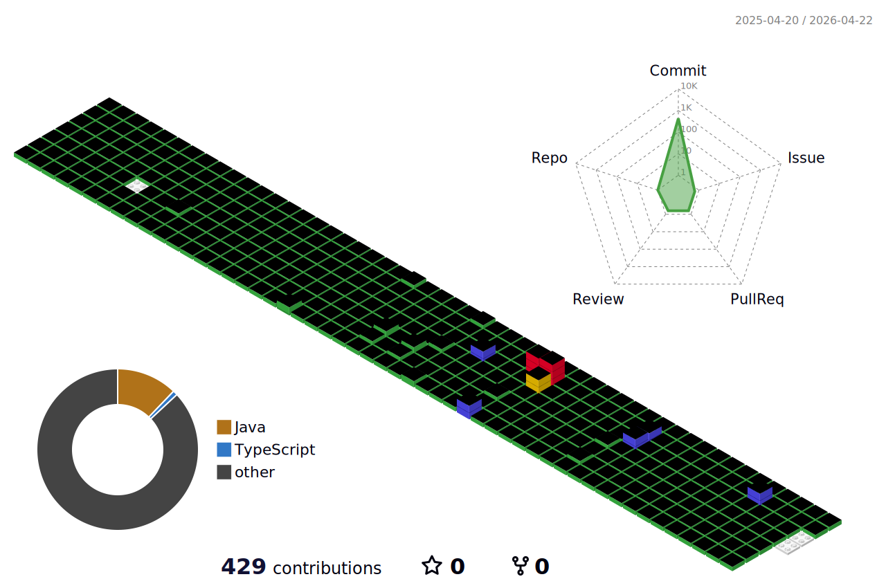

## 👐 Hello World! 👐

  

    
## 🥇 Wins 
|활동|설명| 
|------|---|        
|'삼성증권 디지털 IT학회'|대상|
|메디럭스 X 잇타 연합 해커톤|우수상|

## 💁 About Me

|활동|기간|설명| 
|------|---|---|                                                                    
|동덕여자대학교 IT 동아리 'DALC' 수료|22.03 ~ 22.08|백엔드, AI 파트|                 
|웹개발 동아리 '조인어스월드' 수료|22.08 ~ 23.02|운영진|                             
|IT 연합 앱 런칭 동아리 'UMC 동덕여대 3기' 수료|22.09 ~ 23.02|서버|
|대학생 연합 IT동아리 'It's TIME 잇타'|23.09 ~ |백엔드, 24년 운영진|
|'삼성증권 디지털 IT학회' 수료|23.10 ~ 23.12 |AI|
|대유넥스티어 인턴|24.02 ~  |세일즈포스|
|메디럭스 X 잇타 연합 해커톤|24.05|백엔드|

###

##  🖥️ I use

####

####

 

